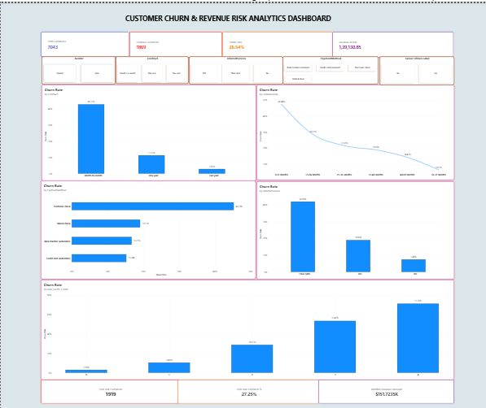

# 📊 Customer Churn Analysis & Revenue Risk Dashboard


## 🌐 Live Project

👉 [🚀 View Live Project](YOUR_GITHUB_PAGES_LINK)

📂 [View GitHub Repository](https://github.com/KALAIYARASI26ELUMALAI/HorizonTechX_CustomerChurn_Analytics_2026)


## 📌 Project Overview

This project analyzes customer churn behavior and identifies revenue risks using **Python and Power BI**.

The main objective is to understand why customers churn, identify high-risk customer segments, measure revenue at risk, and provide actionable business recommendations for customer retention.

---

## 🎯 Project Objectives

- Analyze overall customer churn
- Identify major churn drivers
- Analyze customer segments with high churn rates
- Identify high-risk customers
- Measure monthly revenue at risk
- Analyze risk factors associated with customer churn
- Build an interactive Power BI dashboard
- Provide actionable business recommendations

---

## 🛠️ Technologies Used

- Python
- Pandas
- NumPy
- Matplotlib
- Jupyter Notebook
- Power BI
- DAX
- Git
- GitHub

---

## 📂 Project Structure

```text
HORIZONTECHX_CUSTOMER_CHURN_ANALYTICS/
│
├── dataset/
│   ├── Telco-Customer-Churn.csv
│   └── Telco-Customer-Churn-Cleaned.csv
│
├── notebooks/
│   └── Customer_Churn_Analysis.ipynb
│
├── PowerBI/
│   ├── Customer_Churn_Revenue_Risk_Dashboard.pbix
│   └── Customer_Churn_Revenue_Risk_Dashboard.pdf
│
├── visualizations/
│   ├── Average_Monthly_Charges_by_Churn.png
│   ├── Churn_Rate_by_Contract.png
│   ├── Churn_Rate_by_Dependents_Professional.png
│   ├── Churn_Rate_by_Internet_Service.png
│   ├── Churn_Rate_by_Partner_Status.png
│   ├── Churn_Rate_by_Payment_Method.png
│   ├── Churn_Rate_by_Risk_Factors.png
│   ├── Churn_Rate_by_Senior_Citizen.png
│   ├── Churn_Rate_by_Tenure.png
│   ├── dashboard.png
│   ├── High_Risk_Revenue_Exposure.png
│   ├── Overall_Churn_Distribution.png
│   └── Revenue_at_Risk.png
│
├── README.md
└── .gitignore
```

---

## 📊 Dashboard Preview



---

## 📈 Key Performance Indicators

| Metric | Result |
|---|---:|
| Total Customers | 7,043 |
| Retained Customers | 5,174 |
| Churned Customers | 1,869 |
| Overall Churn Rate | 26.54% |
| Monthly Revenue at Risk | $139,130.85 |
| High-Risk Customers | 1,919 |
| High-Risk Customer Percentage | 27.25% |
| Monthly Revenue Exposure | $151,723.50 |

---

## 🔍 Key Insights

### 1️⃣ Contract Type

Month-to-month customers have the highest churn rate at **42.71%**.

### 2️⃣ Customer Tenure

Customers with **0–12 months tenure** have the highest churn rate at **47.44%**.

### 3️⃣ Payment Method

Customers using **Electronic Check** have the highest churn rate at **45.29%**.

### 4️⃣ Internet Service

**Fiber Optic** customers have a churn rate of **41.89%**.

### 5️⃣ Senior Citizens

Senior Citizens have a churn rate of **41.68%**.

### 6️⃣ Risk Factors

Customers with **4 risk factors** have a churn rate of **71.16%**.

---

## 💰 Revenue Risk Analysis

The analysis identified:

- **1,869** churned customers
- **$139,130.85** monthly revenue at risk
- **1,919** high-risk customers
- **27.25%** of customers classified as high-risk
- **$151,723.50** monthly revenue exposure

---

## 📊 Power BI Dashboard

The interactive Power BI dashboard includes:

- Customer KPI cards
- Overall churn rate
- Churn rate by contract type
- Churn rate by tenure
- Churn rate by payment method
- Churn rate by internet service
- Churn rate by risk factor count
- Revenue at risk
- High-risk customer analysis

---

## 💡 Business Recommendations

- Focus retention campaigns on month-to-month customers.
- Provide stronger onboarding for customers in their first 12 months.
- Investigate churn among Fiber Optic customers.
- Analyze customer experience among Electronic Check users.
- Prioritize customers with 3–4 risk factors.
- Create personalized retention offers for high-risk customers.
- Monitor revenue exposure regularly to reduce potential financial losses.

---

## 🧹 Data Quality

| Data Quality Check | Result |
|---|---:|
| Total Rows | 7,043 |
| Total Columns | 27 |
| Duplicate Rows | 0 |
| Missing Values | 0 |
| Minimum Risk Factors | 0 |
| Maximum Risk Factors | 4 |

---

## 📁 Dataset

The cleaned dataset is available here:

[**Telco-Customer-Churn-Cleaned.csv**](dataset/Telco-Customer-Churn-Cleaned.csv)

---

## 📓 Analysis Notebook

The complete data cleaning, exploratory analysis, visualization, churn analysis, and risk analysis are available here:

[**Customer_Churn_Analysis.ipynb**](notebooks/Customer_Churn_Analysis.ipynb)

---

## 📊 Visualizations

The project includes visualizations covering:

- Churn by Contract
- Churn by Tenure
- Churn by Payment Method
- Churn by Internet Service
- Churn by Senior Citizen Status
- Churn by Partner Status
- Churn by Dependents Status
- Churn by Risk Factors
- Average Monthly Charges by Churn
- Overall Churn Distribution
- Revenue at Risk
- High-Risk Revenue Exposure

---

## 👩‍💻 Author

**Kalaiyarasi E**

Data Analytics | Python | Power BI

---

## ⭐ Project Summary

This project demonstrates an end-to-end **Customer Churn and Revenue Risk Analytics** workflow, starting from data cleaning and exploratory analysis in Python to interactive dashboard development using Power BI.

The analysis helps businesses:

- Identify high-risk customers
- Understand major churn drivers
- Quantify revenue exposure
- Analyze customer risk factors
- Design effective customer retention strategies